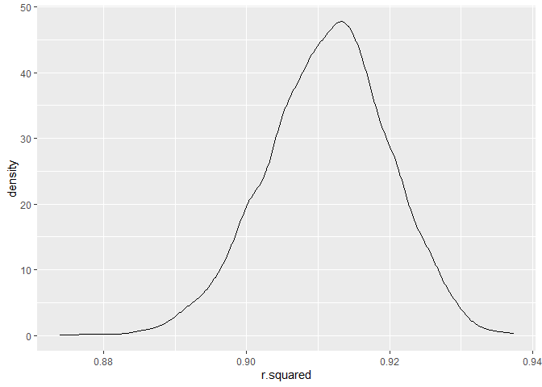
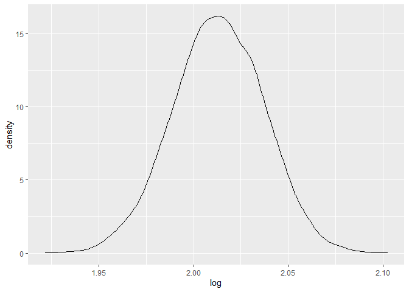

Homework 6
================

## Problem 1

``` r
homicide_df = 
  read_csv("data/homicide-data.csv", na = c("", "NA", "Unknown")) %>% 
  mutate(
    city_state = str_c(city, state, sep = ", "),
    victim_age = as.numeric(victim_age),
    resolution = case_when(
      disposition == "Closed without arrest" ~ 0,
      disposition == "Open/No arrest"        ~ 0,
      disposition == "Closed by arrest"      ~ 1)
  ) %>% 
  filter(
    victim_race %in% c("White", "Black"),
    city_state != "Tulsa, AL") %>% 
  select(city_state, resolution, victim_age, victim_race, victim_sex)
```

    ## Parsed with column specification:
    ## cols(
    ##   uid = col_character(),
    ##   reported_date = col_double(),
    ##   victim_last = col_character(),
    ##   victim_first = col_character(),
    ##   victim_race = col_character(),
    ##   victim_age = col_double(),
    ##   victim_sex = col_character(),
    ##   city = col_character(),
    ##   state = col_character(),
    ##   lat = col_double(),
    ##   lon = col_double(),
    ##   disposition = col_character()
    ## )

Start with one city.

``` r
baltimore_df =
  homicide_df %>% 
  filter(city_state == "Baltimore, MD")
glm(resolution ~ victim_age + victim_race + victim_sex, 
    data = baltimore_df,
    family = binomial()) %>% 
  broom::tidy() %>% 
  mutate(
    OR = exp(estimate),
    CI_lower = exp(estimate - 1.96 * std.error),
    CI_upper = exp(estimate + 1.96 * std.error)
  ) %>% 
  select(term, OR, starts_with("CI")) %>% 
  knitr::kable(digits = 3)
```

| term              |    OR | CI\_lower | CI\_upper |
| :---------------- | ----: | --------: | --------: |
| (Intercept)       | 1.363 |     0.975 |     1.907 |
| victim\_age       | 0.993 |     0.987 |     1.000 |
| victim\_raceWhite | 2.320 |     1.648 |     3.268 |
| victim\_sexMale   | 0.426 |     0.325 |     0.558 |

Try this across cities.

``` r
models_results_df = 
  homicide_df %>% 
  nest(data = -city_state) %>% 
  mutate(
    models = 
      map(.x = data, ~glm(resolution ~ victim_age + victim_race + victim_sex, data = .x, family = binomial())),
    results = map(models, broom::tidy)
  ) %>% 
  select(city_state, results) %>% 
  unnest(results) %>% 
  mutate(
    OR = exp(estimate),
    CI_lower = exp(estimate - 1.96 * std.error),
    CI_upper = exp(estimate + 1.96 * std.error)
  ) %>% 
  select(city_state, term, OR, starts_with("CI")) 
```

``` r
models_results_df %>% 
  filter(term == "victim_sexMale") %>% 
  mutate(city_state = fct_reorder(city_state, OR)) %>% 
  ggplot(aes(x = city_state, y = OR)) + 
  geom_point() + 
  geom_errorbar(aes(ymin = CI_lower, ymax = CI_upper)) + 
  theme(axis.text.x = element_text(angle = 90, hjust = 1))
```


## Problem 2

``` r
baby_df = 
  read_csv("./data/birthweight.csv") %>% 
  mutate(
    gender = case_when(
      babysex == 1 ~ "Male",
      babysex == 2 ~ "Female"),
    mother_race = case_when(
      mrace == 1 ~ "White",
      mrace == 2 ~ "Black",
      mrace == 3 ~ "Asian",
      mrace == 4 ~ "Puerto Rican",
      mrace == 8 ~ "Other"),
    father_race = case_when(
      frace == 1 ~ "White",
      frace == 2 ~ "Black",
      frace == 3 ~ "Asian",
      frace == 4 ~ "Puerto Rican",
      frace == 8 ~ "Other",
      frace == 9 ~ "Unknown")
    ) %>% 
  select(-babysex, -mrace, -frace, -malform)
```

    ## Parsed with column specification:
    ## cols(
    ##   .default = col_double()
    ## )

    ## See spec(...) for full column specifications.

``` r
model = 
  lm(bwt ~ ., data = baby_df) %>% 
  step(., direction='backward') %>% 
  broom::tidy()
```

    ## Start:  AIC=48715.85
    ## bwt ~ bhead + blength + delwt + fincome + gaweeks + menarche + 
    ##     mheight + momage + parity + pnumlbw + pnumsga + ppbmi + ppwt + 
    ##     smoken + wtgain + gender + mother_race + father_race
    ## 
    ## 
    ## Step:  AIC=48715.85
    ## bwt ~ bhead + blength + delwt + fincome + gaweeks + menarche + 
    ##     mheight + momage + parity + pnumlbw + pnumsga + ppbmi + ppwt + 
    ##     smoken + gender + mother_race + father_race
    ## 
    ## 
    ## Step:  AIC=48715.85
    ## bwt ~ bhead + blength + delwt + fincome + gaweeks + menarche + 
    ##     mheight + momage + parity + pnumlbw + ppbmi + ppwt + smoken + 
    ##     gender + mother_race + father_race
    ## 
    ## 
    ## Step:  AIC=48715.85
    ## bwt ~ bhead + blength + delwt + fincome + gaweeks + menarche + 
    ##     mheight + momage + parity + ppbmi + ppwt + smoken + gender + 
    ##     mother_race + father_race
    ## 
    ##               Df Sum of Sq       RSS   AIC
    ## - father_race  4    124393 320850151 48710
    ## - ppbmi        1      6302 320732060 48714
    ## - momage       1     28940 320754697 48714
    ## - mheight      1     66709 320792466 48715
    ## - menarche     1    111982 320837739 48715
    ## - ppwt         1    131067 320856824 48716
    ## <none>                     320725757 48716
    ## - fincome      1    192829 320918586 48716
    ## - parity       1    413380 321139137 48719
    ## - mother_race  3    868381 321594138 48722
    ## - gender       1    852950 321578707 48725
    ## - gaweeks      1   4610634 325336391 48776
    ## - smoken       1   5075231 325800988 48782
    ## - delwt        1   8024938 328750696 48821
    ## - blength      1 102064116 422789873 49913
    ## - bhead        1 106547729 427273486 49959
    ## 
    ## Step:  AIC=48709.53
    ## bwt ~ bhead + blength + delwt + fincome + gaweeks + menarche + 
    ##     mheight + momage + parity + ppbmi + ppwt + smoken + gender + 
    ##     mother_race
    ## 
    ##               Df Sum of Sq       RSS   AIC
    ## - ppbmi        1      6928 320857079 48708
    ## - momage       1     28660 320878811 48708
    ## - mheight      1     69320 320919470 48708
    ## - menarche     1    116027 320966177 48709
    ## - ppwt         1    133894 320984044 48709
    ## <none>                     320850151 48710
    ## - fincome      1    193784 321043934 48710
    ## - parity       1    414482 321264633 48713
    ## - gender       1    851279 321701430 48719
    ## - gaweeks      1   4624003 325474154 48770
    ## - smoken       1   5035195 325885346 48775
    ## - delwt        1   8029079 328879230 48815
    ## - mother_race  3  13553320 334403471 48883
    ## - blength      1 102009225 422859375 49906
    ## - bhead        1 106675331 427525481 49954
    ## 
    ## Step:  AIC=48707.63
    ## bwt ~ bhead + blength + delwt + fincome + gaweeks + menarche + 
    ##     mheight + momage + parity + ppwt + smoken + gender + mother_race
    ## 
    ##               Df Sum of Sq       RSS   AIC
    ## - momage       1     29211 320886290 48706
    ## - menarche     1    117635 320974714 48707
    ## <none>                     320857079 48708
    ## - fincome      1    195199 321052278 48708
    ## - parity       1    412984 321270064 48711
    ## - gender       1    850020 321707099 48717
    ## - mheight      1   1078673 321935752 48720
    ## - ppwt         1   2934023 323791103 48745
    ## - gaweeks      1   4621504 325478583 48768
    ## - smoken       1   5039368 325896447 48773
    ## - delwt        1   8024939 328882018 48813
    ## - mother_race  3  13551444 334408523 48881
    ## - blength      1 102018559 422875638 49904
    ## - bhead        1 106821342 427678421 49953
    ## 
    ## Step:  AIC=48706.02
    ## bwt ~ bhead + blength + delwt + fincome + gaweeks + menarche + 
    ##     mheight + parity + ppwt + smoken + gender + mother_race
    ## 
    ##               Df Sum of Sq       RSS   AIC
    ## - menarche     1    100121 320986412 48705
    ## <none>                     320886290 48706
    ## - fincome      1    240800 321127090 48707
    ## - parity       1    431433 321317724 48710
    ## - gender       1    841278 321727568 48715
    ## - mheight      1   1076739 321963029 48719
    ## - ppwt         1   2913653 323799943 48743
    ## - gaweeks      1   4676469 325562760 48767
    ## - smoken       1   5045104 325931394 48772
    ## - delwt        1   8000672 328886962 48811
    ## - mother_race  3  14667730 335554021 48894
    ## - blength      1 101990556 422876847 49902
    ## - bhead        1 106864308 427750598 49952
    ## 
    ## Step:  AIC=48705.38
    ## bwt ~ bhead + blength + delwt + fincome + gaweeks + mheight + 
    ##     parity + ppwt + smoken + gender + mother_race
    ## 
    ##               Df Sum of Sq       RSS   AIC
    ## <none>                     320986412 48705
    ## - fincome      1    245637 321232048 48707
    ## - parity       1    422770 321409181 48709
    ## - gender       1    846134 321832545 48715
    ## - mheight      1   1012240 321998651 48717
    ## - ppwt         1   2907049 323893461 48743
    ## - gaweeks      1   4662501 325648912 48766
    ## - smoken       1   5073849 326060260 48771
    ## - delwt        1   8137459 329123871 48812
    ## - mother_race  3  14683609 335670021 48894
    ## - blength      1 102191779 423178191 49903
    ## - bhead        1 106779754 427766166 49950

``` r
model
```

    ## # A tibble: 14 x 5
    ##    term                     estimate std.error statistic   p.value
    ##    <chr>                       <dbl>     <dbl>     <dbl>     <dbl>
    ##  1 (Intercept)             -6145.      142.      -43.3   0.       
    ##  2 bhead                     131.        3.45     37.9   3.10e-272
    ##  3 blength                    74.9       2.02     37.1   4.29e-262
    ##  4 delwt                       4.11      0.392    10.5   2.26e- 25
    ##  5 fincome                     0.318     0.175     1.82  6.88e-  2
    ##  6 gaweeks                    11.6       1.46      7.93  2.79e- 15
    ##  7 mheight                     6.59      1.78      3.69  2.23e-  4
    ##  8 parity                     96.3      40.3       2.39  1.70e-  2
    ##  9 ppwt                       -2.68      0.427    -6.26  4.20e- 10
    ## 10 smoken                     -4.84      0.586    -8.27  1.75e- 16
    ## 11 genderMale                -28.6       8.45     -3.38  7.37e-  4
    ## 12 mother_raceBlack          -63.9      42.4      -1.51  1.32e-  1
    ## 13 mother_racePuerto Rican   -25.8      45.4      -0.569 5.70e-  1
    ## 14 mother_raceWhite           74.9      42.3       1.77  7.68e-  2

``` r
model_fit = lm(bwt ~ bhead + blength + delwt + fincome + gaweeks + mheight + 
    parity + ppwt + smoken + gender + mother_race, data = baby_df)
```

``` r
baby_df %>% 
  modelr::add_residuals(model_fit) %>%
  modelr::add_predictions(model_fit) %>% 
  ggplot(aes(x = pred, y = resid)) + 
  geom_point()
```


``` r
model_blength_gaweeks = lm(bwt ~ blength + gaweeks, data = baby_df)
model_interaction = lm(bwt ~ bhead * blength * gender, data = baby_df)
```

``` r
cv_df = 
  crossv_mc(baby_df, 100) %>% 
  mutate(
    train = map(train, as_tibble),
    test = map(test, as_tibble)
  ) %>% 
  mutate(
    model_fit = map(.x = train, ~lm(bwt ~ bhead + blength + delwt + fincome + gaweeks + mheight + parity + ppwt + smoken + gender + mother_race, data = .x)),
    model_blength_gaweeks = map(.x = train, ~ lm(bwt ~ blength + gaweeks, data = .x)),
    model_interaction = map(.x = train, ~lm(bwt ~ bhead * blength * gender, data = .x))
  ) %>% 
  mutate(
    rmse_model_fit = map2_dbl(.x = model_fit, .y = test, ~rmse(model = .x, data = .y)),
    rmse_blength_gaweeks = map2_dbl(.x = model_blength_gaweeks, .y = test, ~rmse(model = .x, data = .y)),
    rmse_interaction = map2_dbl(.x = model_interaction, .y = test, ~rmse(model = .x, data = .y))
  )
```

``` r
cv_df %>% 
  select(starts_with("rmse")) %>% 
  pivot_longer(
    everything(),
    names_to = "model",
    values_to = "rmse",
    names_prefix = "rmse_"
  ) %>% 
  ggplot(aes(x = model, y = rmse)) +
  geom_violin()
```


## Problem 3

``` r
weather_df = 
  rnoaa::meteo_pull_monitors(
    c("USW00094728"),
    var = c("PRCP", "TMIN", "TMAX"), 
    date_min = "2017-01-01",
    date_max = "2017-12-31") %>%
  mutate(
    name = recode(id, USW00094728 = "CentralPark_NY"),
    tmin = tmin / 10,
    tmax = tmax / 10) %>%
  select(name, id, everything())
```

    ## Registered S3 method overwritten by 'hoardr':
    ##   method           from
    ##   print.cache_info httr

    ## using cached file: C:\Users\DELL\AppData\Local\Cache/R/noaa_ghcnd/USW00094728.dly

    ## date created (size, mb): 2020-10-05 16:32:26 (7.537)

    ## file min/max dates: 1869-01-01 / 2020-10-31

``` r
weather_bootstrap_rsquared = 
  weather_df %>% 
  bootstrap(n = 5000, id = "strap_number") %>% 
  mutate(
    models = map(.x = strap, ~lm(tmax ~ tmin, data = .x)), 
    results = map(models, broom::glance)
  )%>% 
  select(results) %>% 
  unnest(results) 
```

``` r
weather_bootstrap_rsquared %>% 
  ggplot(aes(x = r.squared)) + 
  geom_density()
```



``` r
weather_bootstrap_rsquared %>%
  summarise(
    ci_lower=quantile(r.squared,0.025),
    ci_upper=quantile(r.squared,0.975)
  )
```

    ## # A tibble: 1 x 2
    ##   ci_lower ci_upper
    ##      <dbl>    <dbl>
    ## 1    0.894    0.928

``` r
weather_bootstrap_log = 
  weather_df %>% 
  bootstrap(n = 5000, id = "strap_number") %>% 
  mutate(
    models = map(.x = strap, ~lm(tmax ~ tmin, data = .x)), 
    results = map(models, broom::tidy)
  )%>% 
  select(results, strap_number) %>% 
  unnest(results)%>%
  select(term, estimate, strap_number) %>% 
  pivot_wider(
    names_from = "term",  
    values_from = "estimate") %>% 
  mutate( log = log(`(Intercept)`*tmin))
```

``` r
weather_bootstrap_log %>% 
  ggplot(aes(x = log)) + 
  geom_density()
```



``` r
weather_bootstrap_log %>%
  summarise(
    ci_lower=quantile(log,0.025),
    ci_upper=quantile(log,0.975)
  )
```

    ## # A tibble: 1 x 2
    ##   ci_lower ci_upper
    ##      <dbl>    <dbl>
    ## 1     1.96     2.06
