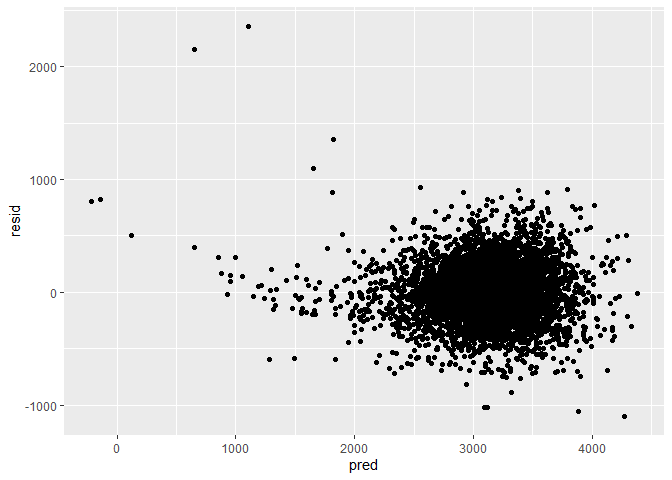

Homework 6
================

## Problem 1

Start with one city.

``` r
baltimore_df =
  homicide_df %>% 
  filter(city_state == "Baltimore, MD")
glm(resolution ~ victim_age + victim_race + victim_sex, 
    data = baltimore_df,
    family = binomial()) %>% 
  broom::tidy() %>% 
  mutate(
    OR = exp(estimate),
    CI_lower = exp(estimate - 1.96 * std.error),
    CI_upper = exp(estimate + 1.96 * std.error)
  ) %>% 
  select(term, OR, starts_with("CI")) %>% 
  knitr::kable(digits = 3)
```

| term              |    OR | CI\_lower | CI\_upper |
| :---------------- | ----: | --------: | --------: |
| (Intercept)       | 1.363 |     0.975 |     1.907 |
| victim\_age       | 0.993 |     0.987 |     1.000 |
| victim\_raceWhite | 2.320 |     1.648 |     3.268 |
| victim\_sexMale   | 0.426 |     0.325 |     0.558 |

Try this across cities.

``` r
models_results_df = 
  homicide_df %>% 
  nest(data = -city_state) %>% 
  mutate(
    models = 
      map(.x = data, ~glm(resolution ~ victim_age + victim_race + victim_sex, data = .x, family = binomial())),
    results = map(models, broom::tidy)
  ) %>% 
  select(city_state, results) %>% 
  unnest(results) %>% 
  mutate(
    OR = exp(estimate),
    CI_lower = exp(estimate - 1.96 * std.error),
    CI_upper = exp(estimate + 1.96 * std.error)
  ) %>% 
  select(city_state, term, OR, starts_with("CI")) 
```

``` r
models_results_df %>% 
  filter(term == "victim_sexMale") %>% 
  mutate(city_state = fct_reorder(city_state, OR)) %>% 
  ggplot(aes(x = city_state, y = OR)) + 
  geom_point() + 
  geom_errorbar(aes(ymin = CI_lower, ymax = CI_upper)) + 
  theme(axis.text.x = element_text(angle = 90, hjust = 1))
```

<!-- -->

## Problem 2

``` r
baby_df = 
  read_csv("./data/birthweight.csv") %>% 
  mutate(
    gender = case_when(
      babysex == 1 ~ "Male",
      babysex == 2 ~ "Female"),
    mother_race = case_when(
      mrace == 1 ~ "White",
      mrace == 2 ~ "Black",
      mrace == 3 ~ "Asian",
      mrace == 4 ~ "Puerto Rican",
      mrace == 8 ~ "Other"),
    father_race = case_when(
      frace == 1 ~ "White",
      frace == 2 ~ "Black",
      frace == 3 ~ "Asian",
      frace == 4 ~ "Puerto Rican",
      frace == 8 ~ "Other",
      frace == 9 ~ "Unknown")
    ) %>% 
  select(-babysex, -mrace, -frace, -malform)
```

    ## Parsed with column specification:
    ## cols(
    ##   .default = col_double()
    ## )

    ## See spec(...) for full column specifications.

``` r
model
```

    ## # A tibble: 14 x 5
    ##    term                     estimate std.error statistic   p.value
    ##    <chr>                       <dbl>     <dbl>     <dbl>     <dbl>
    ##  1 (Intercept)             -6145.      142.      -43.3   0.       
    ##  2 bhead                     131.        3.45     37.9   3.10e-272
    ##  3 blength                    74.9       2.02     37.1   4.29e-262
    ##  4 delwt                       4.11      0.392    10.5   2.26e- 25
    ##  5 fincome                     0.318     0.175     1.82  6.88e-  2
    ##  6 gaweeks                    11.6       1.46      7.93  2.79e- 15
    ##  7 mheight                     6.59      1.78      3.69  2.23e-  4
    ##  8 parity                     96.3      40.3       2.39  1.70e-  2
    ##  9 ppwt                       -2.68      0.427    -6.26  4.20e- 10
    ## 10 smoken                     -4.84      0.586    -8.27  1.75e- 16
    ## 11 genderMale                -28.6       8.45     -3.38  7.37e-  4
    ## 12 mother_raceBlack          -63.9      42.4      -1.51  1.32e-  1
    ## 13 mother_racePuerto Rican   -25.8      45.4      -0.569 5.70e-  1
    ## 14 mother_raceWhite           74.9      42.3       1.77  7.68e-  2

``` r
model_fit = lm(bwt ~ bhead + blength + delwt + fincome + gaweeks + mheight + 
    parity + ppwt + smoken + gender + mother_race, data = baby_df)
```

``` r
baby_df %>% 
  modelr::add_residuals(model_fit) %>%
  modelr::add_predictions(model_fit) %>% 
  ggplot(aes(x = pred, y = resid)) + 
  geom_point()
```

<!-- -->

``` r
model_blength_gaweeks = lm(bwt ~ blength + gaweeks, data = baby_df)
model_interaction = lm(bwt ~ bhead * blength * gender, data = baby_df)
```

``` r
cv_df = 
  crossv_mc(baby_df, 100) %>% 
  mutate(
    train = map(train, as_tibble),
    test = map(test, as_tibble)
  ) %>% 
  mutate(
    model_fit = map(.x = train, ~lm(bwt ~ bhead + blength + delwt + fincome + gaweeks + mheight + parity + ppwt + smoken + gender + mother_race, data = .x)),
    model_blength_gaweeks = map(.x = train, ~ lm(bwt ~ blength + gaweeks, data = .x)),
    model_interaction = map(.x = train, ~lm(bwt ~ bhead * blength * gender, data = .x))
  ) %>% 
  mutate(
    rmse_model_fit = map2_dbl(.x = model_fit, .y = test, ~rmse(model = .x, data = .y)),
    rmse_blength_gaweeks = map2_dbl(.x = model_blength_gaweeks, .y = test, ~rmse(model = .x, data = .y)),
    rmse_interaction = map2_dbl(.x = model_interaction, .y = test, ~rmse(model = .x, data = .y))
  )
```

``` r
cv_df %>% 
  select(starts_with("rmse")) %>% 
  pivot_longer(
    everything(),
    names_to = "model",
    values_to = "rmse",
    names_prefix = "rmse_"
  ) %>% 
  ggplot(aes(x = model, y = rmse)) +
  geom_violin()
```

<!-- -->

## Problem 3

``` r
weather_df = 
  rnoaa::meteo_pull_monitors(
    c("USW00094728"),
    var = c("PRCP", "TMIN", "TMAX"), 
    date_min = "2017-01-01",
    date_max = "2017-12-31") %>%
  mutate(
    name = recode(id, USW00094728 = "CentralPark_NY"),
    tmin = tmin / 10,
    tmax = tmax / 10) %>%
  select(name, id, everything())
```

``` r
set.seed(1)

weather_bootstrap_rsquared = 
  weather_df %>% 
  bootstrap(n = 5000, id = "strap_number") %>% 
  mutate(
    models = map(.x = strap, ~lm(tmax ~ tmin, data = .x)), 
    results = map(models, broom::glance)
  )%>% 
  select(results) %>% 
  unnest(results) 
```

``` r
weather_bootstrap_rsquared %>% 
  ggplot(aes(x = r.squared)) + 
  geom_density()
```

<!-- -->

``` r
weather_bootstrap_rsquared %>%
  summarise(
    ci_lower=quantile(r.squared,0.025),
    ci_upper=quantile(r.squared,0.975)
  )
```

    ## # A tibble: 1 x 2
    ##   ci_lower ci_upper
    ##      <dbl>    <dbl>
    ## 1    0.894    0.927

``` r
set.seed(1)

weather_bootstrap_log = 
  weather_df %>% 
  bootstrap(n = 5000, id = "strap_number") %>% 
  mutate(
    models = map(.x = strap, ~lm(tmax ~ tmin, data = .x)), 
    results = map(models, broom::tidy)
  )%>% 
  select(results, strap_number) %>% 
  unnest(results)%>%
  select(term, estimate, strap_number) %>% 
  pivot_wider(
    names_from = "term",  
    values_from = "estimate") %>% 
  mutate( log = log(`(Intercept)`*tmin))
```

``` r
weather_bootstrap_log %>% 
  ggplot(aes(x = log)) + 
  geom_density() 
```

<!-- -->

``` r
weather_bootstrap_log %>%
  summarise(
    ci_lower=quantile(log,0.025),
    ci_upper=quantile(log,0.975)
  )
```

    ## # A tibble: 1 x 2
    ##   ci_lower ci_upper
    ##      <dbl>    <dbl>
    ## 1     1.96     2.06
